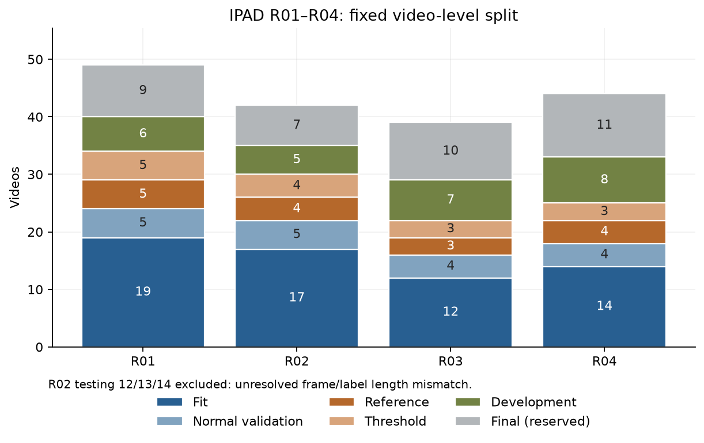
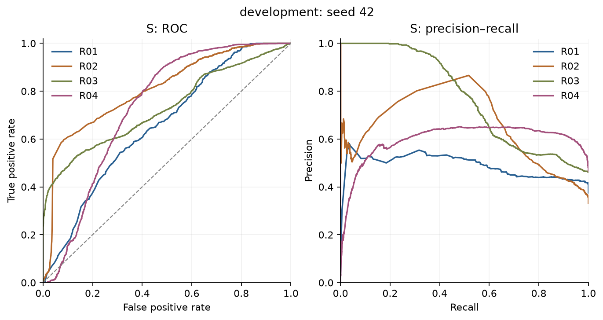
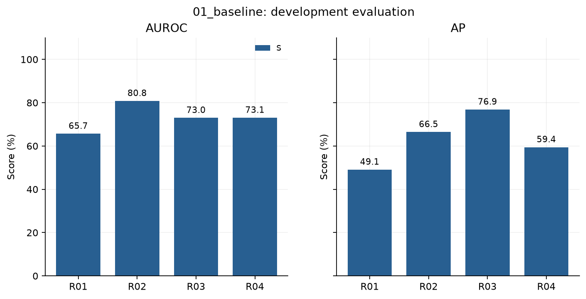
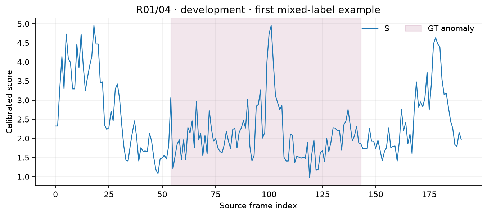
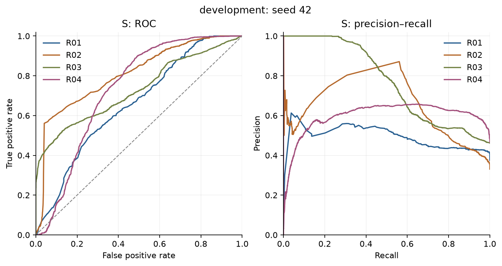
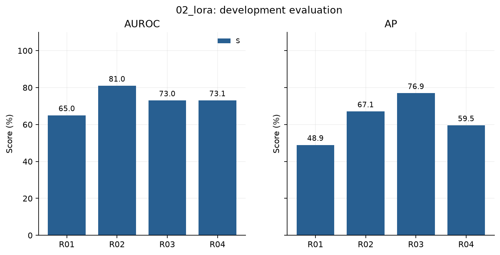
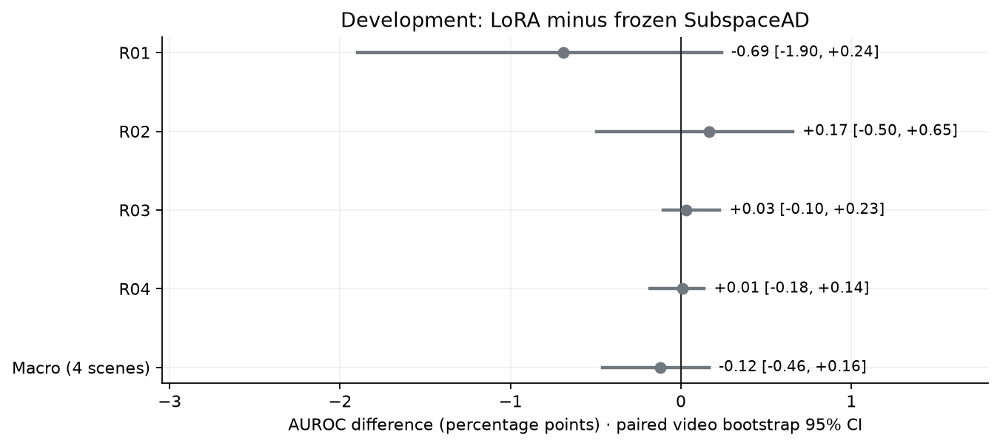
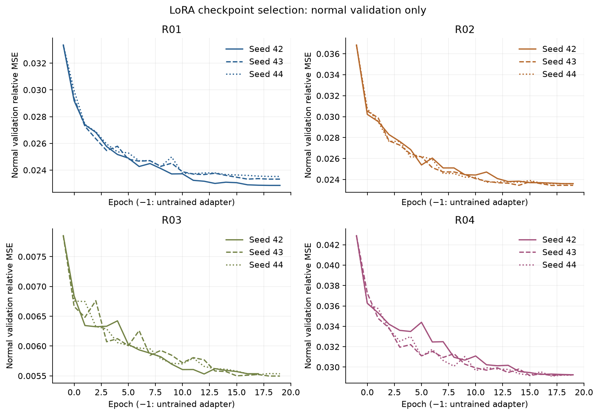
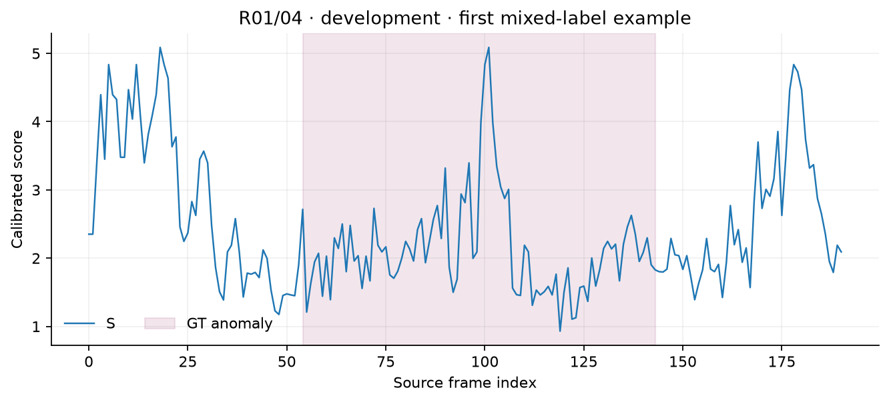

# IPAD Cycle-Aware SubspaceAD

**연속 공정 진행도에 따라 정상 평균을 바꾸고 잔차 subspace를 공유하는 모듈의 유용성**을 IPAD R01–R04에서 검증합니다.

실험 순서는 **Frozen SubspaceAD → 정상 영상 LoRA의 채택 판단 → 선택한 백본에서 C/P ablation**입니다. 각 단계의 코드·로그·결과·그림을 함께 게시합니다. 아직 실행하지 않은 결과나 성능 개선을 주장하지 않습니다.

핵심 아이디어는 **연속 진행도 조건부 평균–공유 잔차 부분공간 모델**입니다. 정상 특징을 아래처럼 표현합니다.

$$z_t = \tilde\mu(\hat\phi_t) + U a_t + \varepsilon_t$$

여기서 진행도 추정값 $\hat\phi_t$에 따라 정상 평균 $\tilde\mu$가 연속적으로 변하고, 잔차 기저 $U$는 모든 진행도에서 공유합니다. $\tilde\mu$는 정상 영상으로 학습한 Fourier 평균과 잔차 PCA의 중심을 합한 값입니다. C는 이 모델의 잔차 및 부분공간 내부 거리에서, P는 진행도 추적 오차에서 얻습니다.

## 진행 상태

| 단계 | 상태 | 결과 |
| --- | --- | --- |
| 데이터·설정·구현 검증 | 완료 | [상세](results/00_prepare/report.md) |
| Frozen SubspaceAD | 완료 | [상세](results/01_baseline/report.md) |
| LoRA 학습·채택 판단 | 완료 | [상세](results/02_lora/report.md) |
| 진행도 모듈 ablation | 미실행 | — |

## 방법과 평가 규약

- DINOv2-base 336px, 공식 중간층 `[-4,-5]` 평균, 정상 patch PCA 99% 설명분산, 공식 재구성 잔차·확대/블러·상위 1% 집계. 원 논문의 Giant/672px 벤치마크 수치 재현이 아닌 **IPAD 방법 적용 실험**입니다.
- S: SubspaceAD, C: 진행도 조건부 외형 점수, P: 정렬·innovation·진행 오차. 결합은 `max`, 가중치 1로 고정합니다.
- 정상 training을 fit/validation/reference/threshold = 55/15/15/15%로 영상 단위 분리합니다. 유효 testing은 약 40% 개발 / 60% 최종 평가입니다. 프레임 단위 random split을 사용하지 않습니다.
- 주 지표는 장면별 frame AUROC와 네 장면 macro 평균입니다. AP, 정상 q99 임계값의 F1/TPR/FPR와 이벤트 탐지도 보고합니다. 모든 평가 프레임을 stride 1로 관측합니다.
- LoRA 채택 기준: 개발셋 seed 42·43·44 평균 macro AUROC +1%p 이상 **및** 영상 단위 paired bootstrap 95% 구간 하한 > 0. 최종 결과를 보고 백본을 다시 선택하지 않습니다.
- 실제 cycle 경계와 원본 녹화 그룹이 없습니다. `weak_recording_alignment`를 사용하며 cycle 위치 정확도·원본 그룹 독립성을 주장하지 않습니다.
- R02 testing 12·13·14는 프레임/라벨 길이가 불일치하여 공통 제외합니다. 자세한 목록은 [exclusions.csv](results/00_prepare/exclusions.csv)를 참고하세요.
- 과거 테스트 결과 확인 이력이 있는 후속 실험입니다. 최종 분할은 이번 모델 선택에서 제외하지만 완전히 새로운 미관측 데이터로 표현하지 않습니다.



설정: [experiment.json](configs/experiment.json) · [분할 manifest](results/00_prepare/splits.json) · [상세 규약](docs/EXPERIMENT_DESIGN.md) · [출처와 대응](docs/SOURCE_MAPPING.md)

## Frozen SubspaceAD

장면·seed 평균, 단위 %. 개발셋과 최종 평가셋을 구분합니다.

| partition | branch | auroc | ap | f1 | tpr | fpr |
| --- | --- | --- | --- | --- | --- | --- |
| development | S | 73.129 | 62.964 | 17.330 | 11.018 | 2.024 |

| partition | scene | branch | auroc | ap |
| --- | --- | --- | --- | --- |
| development | R01 | S | 65.667 | 49.096 |
| development | R02 | S | 80.809 | 66.457 |
| development | R03 | S | 72.986 | 76.851 |
| development | R04 | S | 73.051 | 59.450 |







### 해석

개발셋 26개 영상, 12,954프레임에서 **macro AUROC 73.13%**, **macro AP 62.96%**입니다. 장면별 AUROC는 R01 65.67%, R02 80.81%, R03 72.99%, R04 73.05%입니다. 표의 S는 결합 실험을 위한 정상 reference 보정 점수이며, 원시 공식 점수와의 AUROC 차이는 [대조표](results/01_baseline/raw_vs_calibrated_auroc.csv)에 별도로 보존합니다.

- 정상 q99 임계값에서 R04 TPR은 **0%**입니다. AUROC 73.05%라는 순위 분리 성능이 해당 경보 임계값의 높은 recall을 보장하지 않습니다. 임계값을 개발 라벨에 맞춰 낮추지 않습니다.
- R01 FPR은 **5.95%**로 정상 threshold 분할의 목표 1%보다 큽니다. 정상 분할에서 정한 q99가 새 영상에서 1% FPR을 보장하지 않는 사례입니다.
- PCA rank는 R01/R02/R03/R04 = **281/323/383/359**이고, 모든 장면에서 목표 설명분산 99%를 달성했습니다.
- frozen 특징·PCA는 결정적이어서 한 번 측정한 결과를 이후 3개 LoRA seed와 paired 비교합니다. 같은 수치를 독립 반복으로 세지 않습니다.
- 최종 평가셋은 이 단계에 사용하지 않았습니다. 결과는 LoRA 채택 판단에 쓰일 개발셋 baseline입니다.

### 검증과 비용

압축 프레임 CSV에서 별도 sklearn 지표 계산과 영상별 이벤트 순회로 모든 장면 수치를 재검증했습니다. [검증 로그](results/01_baseline/metric_verification.json)를 제공합니다. 최종 집계에서 Pandas `gt` 이름과 메서드가 충돌한 오류를 수정했으며, 저장된 점수에서 집계를 복구했습니다. 재추출은 하지 않았고 수정 이력은 recovery 로그에 남겼습니다.

추출·점수 계산 기록의 합은 403.0초, 관측 peak allocated VRAM은 2.39GiB입니다. 시간은 파일 읽기와 전처리를 포함하고 cache 압축·전체 보고서 생성은 제외합니다. 실행 중 짧은 LoRA GPU 검증이 병행됐으므로 엄격히 격리된 추론 속도 벤치마크가 아닙니다.

[상세 분석·로그](results/01_baseline/report.md)

## LoRA 학습·채택 판단

장면·seed 평균, 단위 %. 개발셋과 최종 평가셋을 구분합니다.

| partition | branch | auroc | ap | f1 | tpr | fpr |
| --- | --- | --- | --- | --- | --- | --- |
| development | S | 73.007 | 63.118 | 18.106 | 11.645 | 2.480 |

| partition | scene | branch | auroc | ap |
| --- | --- | --- | --- | --- |
| development | R01 | S | 64.977 | 48.926 |
| development | R02 | S | 80.974 | 67.080 |
| development | R03 | S | 73.016 | 76.941 |
| development | R04 | S | 73.060 | 59.524 |











### 채택 판단

**LoRA를 채택하지 않고 frozen DINOv2로 모듈 실험을 진행합니다.** 개발셋 macro AUROC는 frozen **73.13%**, LoRA seed 평균 **73.01%**입니다. 차이는 **-0.12%p**, 영상 단위 paired bootstrap 95% 구간은 **[-0.46, +0.16]%p**입니다.

사전에 정한 두 조건(평균 +1%p 이상, 95% 하한 > 0)을 모두 만족할 때만 LoRA를 채택합니다. 정상 validation 손실 감소 자체를 이상 탐지 향상으로 해석하지 않습니다. 장면별로 유리한 백본을 따로 고르지 않았으며 최종 평가 라벨은 채택 판단에 사용하지 않았습니다.

[채택 근거 JSON](results/02_lora/backbone_decision.json) · [frozen 대조표](results/02_lora/frozen_comparison.csv) · [학습 요약](results/02_lora/training_summary.csv)

Seed별 macro AUROC는 **seed 42: 73.18%, seed 43: 72.95%, seed 44: 72.89%**입니다. [Seed별 성능표](results/02_lora/performance_by_seed.csv)에 AP와 frozen 대비 차이도 보존합니다. Bootstrap 구간은 관측된 세 seed 평균을 대상으로 영상 표집의 불확실성을 나타냅니다.

### 학습 및 불확실성

12개 fit 모두 정상 training/validation 영상만 사용했습니다. 원래 DINOv2 가중치의 학습 전후 SHA256 일치와 adapter 체크포인트 SHA256을 각 training 로그에 남겼습니다. 신뢰구간은 장면·라벨 유형 내 영상을 재표집하고 같은 표집을 모든 seed와 두 백본에 적용한 10,000회 결과입니다. 프레임이나 seed를 독립 표본으로 세지 않습니다. 원본 녹화 그룹을 알 수 없고 일부 strata의 영상 수가 작아 이 구간을 광범위한 일반화의 보장으로 해석할 수 없습니다.

전체 LoRA 학습 기록 합계 237.9분, 관측 peak allocated VRAM 7.13GiB입니다. 평가 추출 비용은 별도의 영상 로그에 있습니다.

[상세 분석·로그](results/02_lora/report.md)

## 진행도 모듈 ablation

미실행 또는 집계 전입니다.

## 재현

아래 명령은 이 실험의 Python 3.12·Linux·CUDA 12.8 구성을 기준으로 합니다. `requirements-lock.txt`에 [공식 PyTorch CUDA wheel 인덱스](https://pytorch.org/get-started/previous-versions/#v280)를 포함했습니다. 학습과 특징 추출에는 CUDA GPU가 필요하며, 저장된 결과의 검산과 보고서 생성은 CPU에서 실행할 수 있습니다.

```bash
python -m pip install -r requirements-lock.txt
python -m pip install --no-deps -e .
python scripts/download_model.py
python -m ipad_experiment.pipeline prepare --data-root /path/to/IPAD_dataset
python -m pytest -q
python scripts/verify_gpu.py
python -m ipad_experiment.pipeline baseline --data-root /path/to/IPAD_dataset
python -m ipad_experiment.pipeline report
```

후속 단계 CLI는 `train-lora`, `select-backbone`, `ablation`입니다. 각 단계는 구현·검증 후 실행 상태를 갱신합니다. `report`는 저장된 점수·지표에서 그림과 README를 다시 생성하며 GPU가 필요하지 않습니다. [실행/분석 노트북](notebooks/Experiment.ipynb)을 함께 제공합니다.

각 단계의 저장 점수는 `python scripts/recompute_metrics.py --run 02_lora`로 지표를 독립 재계산하고, `python scripts/verify_artifacts.py --run 02_lora --data-root /path/to/IPAD_dataset`으로 영상·프레임 범위와 원본 GT의 프레임별 일치를 검사할 수 있습니다. `--run`에는 검사할 단계 이름을 지정합니다.

## 결과 파일 정책

GitHub에는 코드·설정·분할·구조화 로그·지표·압축 프레임 점수 CSV·시각자료를 보관합니다. `results/<run_id>`의 manifest에 실행 코드 commit과 SHA256을 남깁니다. 원본 영상/프레임, 특징 캐시, 가중치와 체크포인트는 로컬 `artifacts/`에 보존합니다. 압축 CSV만으로 지표를 독립 재계산할 수 있습니다.

## 출처

- [SubspaceAD 논문](https://arxiv.org/abs/2602.23013), [공식 구현](https://github.com/CLendering/SubspaceAD). 고정 commit 및 라이선스는 [provenance](configs/provenance.json), [Apache-2.0](vendor/SUBSPACEAD_LICENSE)에 기록합니다.
- [IPAD 논문](https://arxiv.org/abs/2404.15033).
- 사용자 제공 `CycleVAD_Colab.ipynb`의 내장 구현: 정상 템플릿·causal tracker·Fourier 평균·공유 잔차 PCA·정상 tail 보정. 노트북 SHA256은 provenance에 기록합니다.
