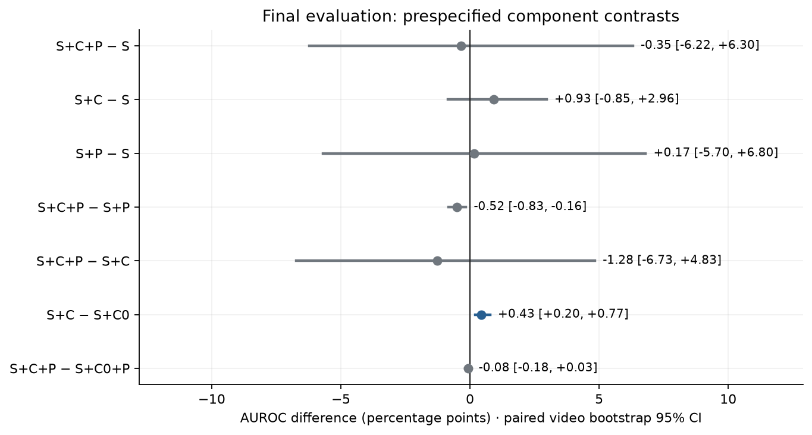
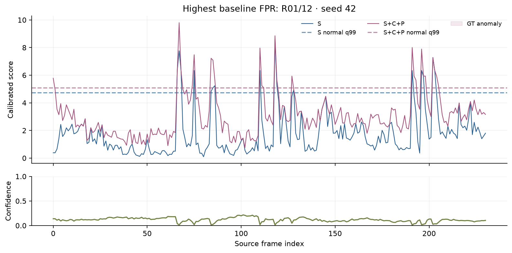
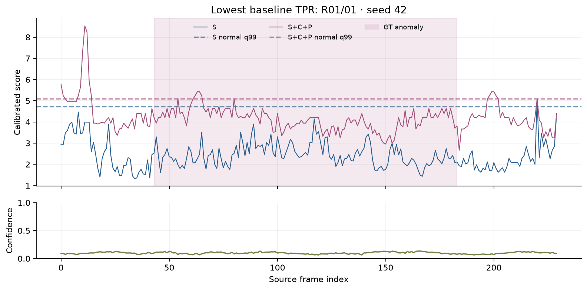
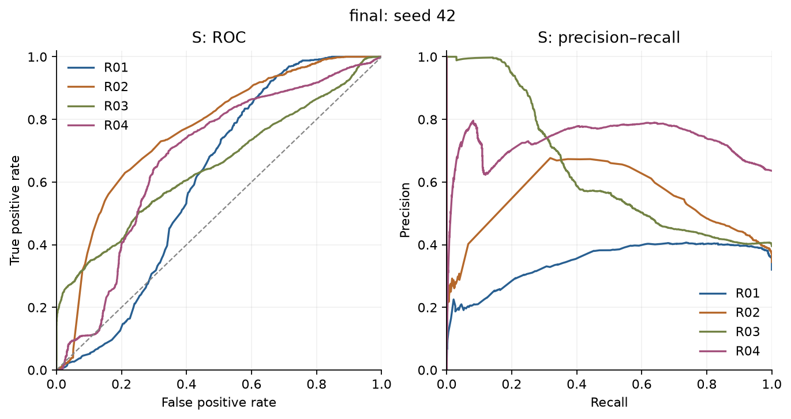
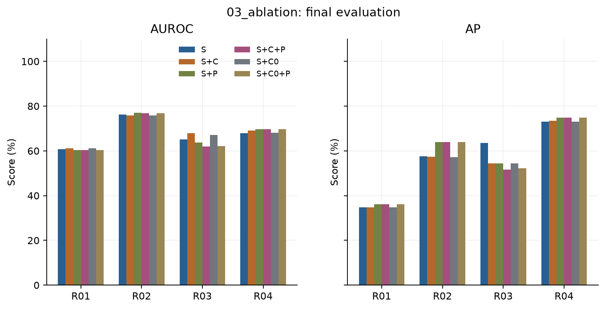
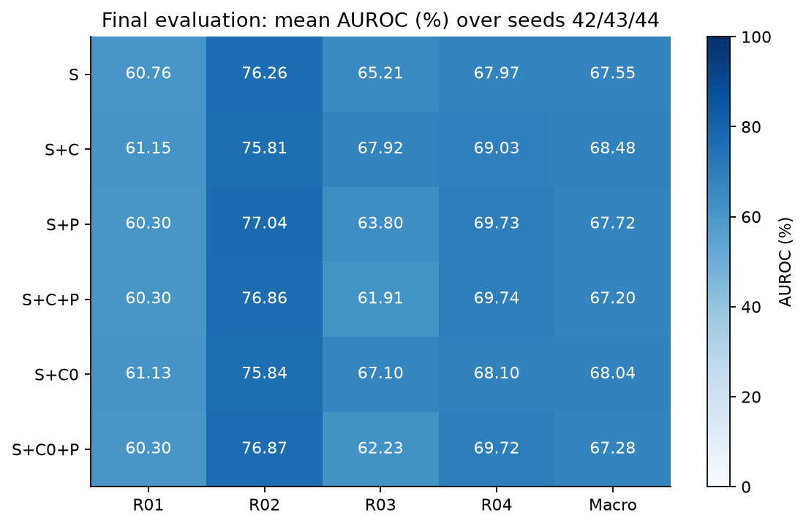
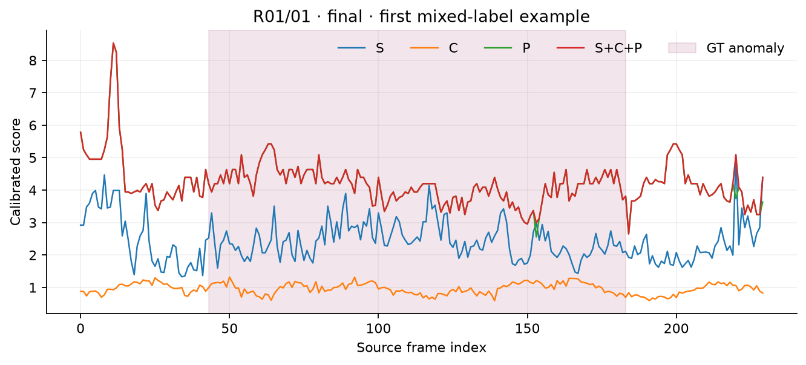

# 03_ablation

| partition | scene | branch | auroc | ap | f1 | tpr | fpr |
| --- | --- | --- | --- | --- | --- | --- | --- |
| final | R01 | S | 0.608 | 0.347 | 0.025 | 0.013 | 0.032 |
| final | R01 | S+C | 0.611 | 0.348 | 0.025 | 0.013 | 0.032 |
| final | R01 | S+P | 0.603 | 0.362 | 0.025 | 0.015 | 0.062 |
| final | R01 | S+C+P | 0.603 | 0.362 | 0.025 | 0.015 | 0.062 |
| final | R01 | S+C0 | 0.611 | 0.348 | 0.025 | 0.013 | 0.032 |
| final | R01 | S+C0+P | 0.603 | 0.362 | 0.025 | 0.015 | 0.062 |
| final | R01 | C | 0.795 | 0.613 | 0.613 | 0.996 | 0.591 |
| final | R01 | P | 0.612 | 0.375 | 0.085 | 0.055 | 0.090 |
| final | R01 | S+C_no_conf | 0.845 | 0.601 | 0.603 | 1.000 | 0.621 |
| final | R01 | S+alignment | 0.652 | 0.412 | 0.075 | 0.044 | 0.052 |
| final | R01 | S+innovation | 0.555 | 0.316 | 0.015 | 0.008 | 0.043 |
| final | R01 | S+progress | 0.586 | 0.340 | 0.032 | 0.018 | 0.057 |
| final | R02 | S | 0.763 | 0.575 | 0.013 | 0.006 | 0.010 |
| final | R02 | S+C | 0.758 | 0.573 | 0.013 | 0.006 | 0.010 |
| final | R02 | S+P | 0.770 | 0.640 | 0.388 | 0.256 | 0.034 |
| final | R02 | S+C+P | 0.769 | 0.639 | 0.388 | 0.256 | 0.034 |
| final | R02 | S+C0 | 0.758 | 0.572 | 0.013 | 0.006 | 0.010 |
| final | R02 | S+C0+P | 0.769 | 0.639 | 0.388 | 0.256 | 0.034 |
| final | R02 | C | 0.463 | 0.346 | 0.318 | 0.332 | 0.395 |
| final | R02 | P | 0.785 | 0.665 | 0.405 | 0.272 | 0.036 |
| final | R02 | S+C_no_conf | 0.746 | 0.664 | 0.510 | 0.353 | 0.017 |
| final | R02 | S+alignment | 0.788 | 0.643 | 0.029 | 0.015 | 0.010 |
| final | R02 | S+innovation | 0.768 | 0.619 | 0.362 | 0.235 | 0.034 |
| final | R02 | S+progress | 0.777 | 0.626 | 0.101 | 0.054 | 0.010 |
| final | R03 | S | 0.652 | 0.635 | 0.325 | 0.196 | 0.006 |
| final | R03 | S+C | 0.679 | 0.545 | 0.329 | 0.218 | 0.069 |
| final | R03 | S+P | 0.638 | 0.543 | 0.169 | 0.097 | 0.033 |
| final | R03 | S+C+P | 0.619 | 0.517 | 0.171 | 0.100 | 0.044 |
| final | R03 | S+C0 | 0.671 | 0.544 | 0.287 | 0.182 | 0.058 |
| final | R03 | S+C0+P | 0.622 | 0.522 | 0.171 | 0.100 | 0.042 |
| final | R03 | C | 0.626 | 0.446 | 0.099 | 0.058 | 0.072 |
| final | R03 | P | 0.563 | 0.483 | 0.142 | 0.080 | 0.033 |
| final | R03 | S+C_no_conf | 0.693 | 0.541 | 0.161 | 0.097 | 0.069 |
| final | R03 | S+alignment | 0.632 | 0.562 | 0.280 | 0.177 | 0.053 |
| final | R03 | S+innovation | 0.623 | 0.548 | 0.141 | 0.079 | 0.026 |
| final | R03 | S+progress | 0.686 | 0.571 | 0.108 | 0.059 | 0.022 |
| final | R04 | S | 0.680 | 0.730 | 0.001 | 0.001 | 0.007 |
| final | R04 | S+C | 0.690 | 0.735 | 0.001 | 0.001 | 0.007 |
| final | R04 | S+P | 0.697 | 0.748 | 0.031 | 0.016 | 0.011 |
| final | R04 | S+C+P | 0.697 | 0.748 | 0.031 | 0.016 | 0.011 |
| final | R04 | S+C0 | 0.681 | 0.731 | 0.001 | 0.001 | 0.007 |
| final | R04 | S+C0+P | 0.697 | 0.748 | 0.031 | 0.016 | 0.011 |
| final | R04 | C | 0.829 | 0.881 | 0.240 | 0.137 | 0.012 |
| final | R04 | P | 0.685 | 0.776 | 0.144 | 0.079 | 0.036 |
| final | R04 | S+C_no_conf | 0.748 | 0.777 | 0.002 | 0.001 | 0.007 |
| final | R04 | S+alignment | 0.697 | 0.736 | 0.001 | 0.001 | 0.007 |
| final | R04 | S+innovation | 0.726 | 0.749 | 0.001 | 0.001 | 0.007 |
| final | R04 | S+progress | 0.658 | 0.732 | 0.031 | 0.016 | 0.011 |

상세: [장면별 지표](metrics_by_scene.csv), [영상별 지표](metrics_by_video.csv), [실행 설정](config.json), [manifest](run_manifest.json), `logs/`, `scores/`.

### 모듈 결과 해석

선택한 백본의 최종 평가 macro AUROC는 **S 67.55% → S+C+P 67.20%**, 차이는 **-0.35%p**입니다. 별도로 측정한 원래 frozen S는 **67.55%**입니다. 개발셋 결과와 최종 평가 수치를 직접 증감 비교하지 않습니다.

전체 결합의 차이(S+C+P − S)에 대한 영상 단위 paired bootstrap 95% 구간은 **[-6.22, +6.30]%p**입니다.

장면별 사후 진단에서 전체 결합의 baseline 대비 차이가 가장 낮은 장면은 **R03 (-3.30%p)**입니다. 같은 장면의 S+C − S는 **+2.71%p**로, P 포함 여부에 따른 차이도 확인해야 합니다. 이는 관측된 장면별 차이이며 진행도 추정 오류의 원인을 입증한 결과는 아닙니다. [Seed별 macro 지표](performance_by_seed.csv)도 함께 보존합니다.

P가 없는 경우, C를 S에 추가한 차이(S+C − S)는 **+0.93%p**, 95% 구간 **[-0.85, +2.96]%p**입니다. 상수 평균 대조(S+C − S+C0)는 **+0.43%p**, 95% 구간 **[+0.20, +0.77]%p**입니다. 이 결과와 아래의 P 포함 대조를 구분해 해석합니다.

연속 정상 평균 C를 S+P에 추가한 차이는 **-0.52%p**, 영상 bootstrap 95% 구간은 **[-0.83, -0.16]%p**입니다. 같은 특징·표본·실제 rank·confidence를 사용하는 상수 평균 C0와의 비교(S+C+P − S+C0+P)는 **-0.08%p**, 95% 구간 **[-0.18, +0.03]%p**입니다.

**S+P에 C를 추가한 최종 결합 맥락에서, 핵심 대조 중 음의 구간이 있어 연속 정상 평균의 유용성이 확인됐다고 결론 내릴 수 없습니다.**

전체 결합의 향상만으로 연속 평균의 기여를 주장하지 않습니다. C 추가 및 C0 대조와 함께 판단하며, 95% 구간이 0을 포함하는 대조는 양의 효과가 확정됐다고 표현하지 않습니다. 7개 대조의 구간은 다중 비교 보정 전 탐색적 구간입니다.

[대조별 수치](comparisons.csv) · [영상별 구성요소 활성도](component_activity_by_video.csv) · [실패 예시 선택 규칙](diagnostic_examples.json)

### 적용 범위와 진단

이 실험은 실제 cycle 경계 없이 정상 녹화 영상 전체를 cycle 후보로 삼는 `weak_recording_alignment` 조건입니다. 추정 angle/confidence는 정상 템플릿과의 정합도이며 정답 진행도와의 오차를 측정한 값이 아닙니다. 영상별 confidence와 C/P가 S를 바꾼 프레임 비율을 남겼습니다. 진단 그림은 baseline FPR이 가장 높은 영상과 TPR이 가장 낮은 영상을 고정 규칙으로 선택하며, 좋은 사례만 고르지 않습니다.

각 branch 임계값은 동일한 정상 threshold 영상의 q99로 따로 정했습니다. 최고 AUROC branch를 사후 선택하거나 최종 라벨로 임계값을 조정하지 않았습니다. rank·설명분산과 정상 validation 선택 내역은 `fit_reports/`, 이벤트 coverage·검출된 이벤트의 지연은 지표 CSV에 있습니다. 지연은 검출된 이벤트만의 조건부 값이므로 미검출 비율과 함께 읽어야 합니다.

공유 잔차 PCA의 실제 rank 범위는 64–64, 보존 설명분산 범위는 73.00–84.02%입니다. 95% 설명분산 목표를 달성한 fit은 0/12개입니다. rank 상한 때문에 목표를 달성하지 못한 경우도 그대로 보고합니다.
